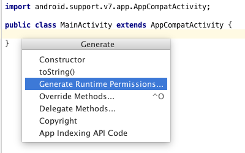
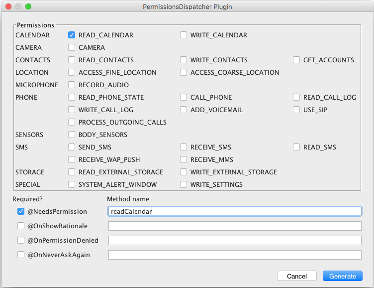
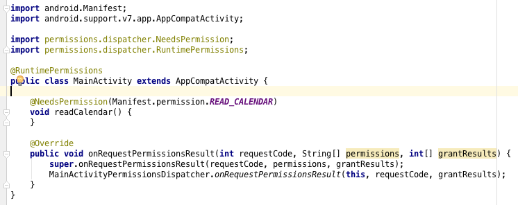

# permissions-dispatcher-plugin

IntelliJ plugin for supporting [PermissionsDispatcher](https://github.com/hotchemi/PermissionsDispatcher). This is NOT official plugin.

PermissionsDispatcher is wonderful library for Runtime Permissions. However, it asks developers "attach annotations" and "delegate to generated class" and then after that "rebuild". It's hard to follow all steps correctly. This plugin generates the skelton of methods for "attach annotations" and "delegate to generated class" using GUI.

# How to use?

* Open Activity/Fragment
* `Generate` -> `Generate Runtime Permissions...`


* Choose permissions and enter method names for each annotations



(For instance, choose READ_CALENDAR and type NeedsPermission's method name as `readCalendar`)
* Click `Generate` button
* Done!



# How to install?

Use the IDE's plugin manager to install the latest version of the plugin.

## License

```
Copyright 2016 Yoshinori Isogai

Licensed under the Apache License, Version 2.0 (the "License");
you may not use this file except in compliance with the License.
You may obtain a copy of the License at

   http://www.apache.org/licenses/LICENSE-2.0

Unless required by applicable law or agreed to in writing, software
distributed under the License is distributed on an "AS IS" BASIS,
WITHOUT WARRANTIES OR CONDITIONS OF ANY KIND, either express or implied.
See the License for the specific language governing permissions and
limitations under the License.
```
